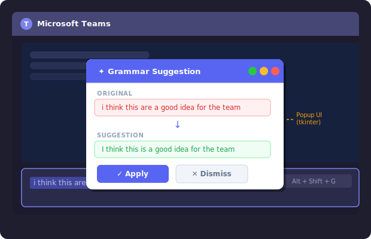

# Teams Grammar Checker

A lightweight Windows background utility that checks grammar in your Microsoft Teams messages using a **local AI model** via [Ollama](https://ollama.com/) — no API keys, no cloud costs.

---

## How It Looks



> Highlight any text in your Teams message box, press **Alt + Shift + G**, and a popup appears with the corrected version. Hit **Apply** to replace it instantly, or **Dismiss** to ignore.

---

## Features

- **Local AI processing** — runs entirely on your machine using Ollama (no internet required after setup)
- **Non-intrusive** — runs silently in the background
- **Simple workflow** — Highlight → Hotkey → Review → Apply
- **Lightweight** — minimal resource usage when idle

---

## Requirements

- Windows 10 / 11
- Python 3.10+
- [Ollama](https://ollama.com/) installed and running locally

---

## Installation

**1. Install Ollama and pull a model:**
```bash
ollama pull llama3.2:3b
```
> 💡 For better accuracy, try `qwen2.5:3b` instead.

**2. Install Python dependencies:**
```bash
pip install pynput pyperclip
```

**3. Run the app:**
```bash
python teams_grammar.py
```

---

## Usage

1. Open Microsoft Teams and type a message
2. **Highlight** the text you want to check
3. Press **Alt + Shift + G**
4. Review the suggestion in the popup
5. Click **✓ Apply** to replace your text, or **✕ Dismiss** to cancel

---

## Auto-start on Windows Boot

To launch the tool automatically when Windows starts:

1. Create a `.bat` file with:
   ```bat
   @echo off
   python "C:\path\to\teams_grammar.py"
   ```
2. Press `Win + R`, type `shell:startup`, and press Enter
3. Move your `.bat` file into that folder

---

## Configuration

Open `teams_grammar.py` to customize:

| Setting | Description |
|---|---|
| `model` | Ollama model to use (e.g. `llama3.2:3b`, `qwen2.5:3b`) |
| Idle timing | Adjust how quickly the script detects idle state |

---

## License

MIT
